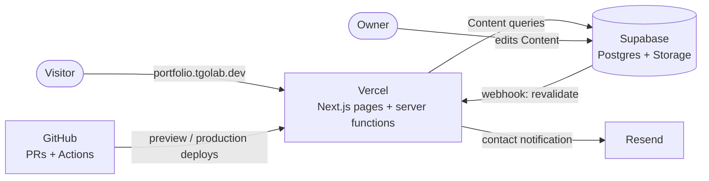

# tgolab — portfolio

Personal portfolio of **Tomasz Gołąb**, Fullstack / Frontend Developer. It tells a recruiter — or an AI agent reading on their behalf — who I am, what I work with and what I have built, in under a minute.

> **Status:** in development. The plan, decisions and every ticket are in this repository (see [How this project is planned](#how-this-project-is-planned)). Target URL: `https://portfolio.tgolab.dev`.

## What it does

- **Hero** — name, Roles cycling in a typewriter, contact links, CV.
- **Skills** — every Skill grouped by category; Skills I have used in a Project link straight to those Projects.
- **Projects** — cards with context, summary, headline Metrics and Skills; a filter by Skill (AND, shareable URL); a dedicated page per Project with problem, role, challenges, outcomes, stack and screenshots.
- **Contact** — copyable email, CV, LinkedIn, GitHub and a spam-protected contact form.
- **Polish and English** — every page under `/pl/…` and `/en/…`.
- **Light and dark mode** — follows the system, remembers the choice, no flash on load.
- **Readable by machines** — server-rendered HTML, JSON-LD, `llms.txt`, sitemap with language alternates.

Content (Skills, Projects) lives in a database and is edited without touching code or deploying.

## Tech stack

| Area              | Choice                                                          |
| ----------------- | --------------------------------------------------------------- |
| Framework         | Next.js (App Router), React, TypeScript                         |
| Styling           | Tailwind CSS with design tokens for both themes                 |
| i18n              | next-intl, Locale in the URL                                    |
| Content & storage | Supabase (Postgres + Storage)                                   |
| Forms             | React Hook Form + Zod, Server Actions                           |
| Email             | Resend                                                          |
| Testing           | Vitest, Testing Library, Playwright                             |
| CI/CD             | GitHub Actions, Vercel (preview per PR, production on `master`) |
| Analytics         | Vercel Web Analytics (cookieless)                               |

Everything runs on free tiers.

## Architecture



- **Frontend and backend are one Next.js app on Vercel.** Pages are statically rendered and cached; Server Components, Server Actions ("show more" Projects, the contact form) and route handlers (revalidation, keep-alive) run as serverless functions.
- **The browser never talks to the database.** All data access goes through one content module on the server.
- **Content changes don't need a deploy.** A Supabase database webhook calls a secured revalidation endpoint and the affected pages are regenerated within seconds.
- **One content module, two sources.** Production reads Supabase; tests and local development read in-repo fixtures through the same interface, so CI never needs the database.

Key decisions are recorded as ADRs in [`docs/adr/`](docs/adr/); the domain vocabulary is in [`CONTEXT.md`](CONTEXT.md).

## Development workflow

This repository is run the way I work on production teams:

- **Small PRs, one ticket each.** Every change goes through a pull request into a protected `master`, squash-merged.
- **Conventional Commits.** PR titles follow the spec (`feat: …`, `fix: …`, `docs: …`), checked in CI; the squashed commit on `master` uses that title.
- **Branch naming:** `feat/…`, `fix/…`, `chore/…`, `docs/…`, `test/…`.
- **CI on every PR:** lint, typecheck, unit tests, production build and end-to-end tests must pass.
- **Preview deployments:** every PR gets its own Vercel URL for review before merge.
- **Test-first where it pays off:** behaviour is specified by tests at the module seams before implementation.

## Testing strategy

Tests assert behaviour through public interfaces, never implementation details.

| Seam               | Tool       | What it covers                                                                                                                                 |
| ------------------ | ---------- | ---------------------------------------------------------------------------------------------------------------------------------------------- |
| The whole app      | Playwright | Real production build with fixture Content: Locale switch, theme, "show more", Skill filter, Project pages, contact form, 404, structured data |
| Content module     | Vitest     | Locale resolution, ordering, published-only, pagination, Skill filter (AND), next-Project lookup                                               |
| Contact submission | Vitest     | Validation, honeypot and timing checks, rate limit, storing and notifying (with fakes)                                                         |

Supabase and Resend integrations are verified manually on each PR's preview deployment.

## How this project is planned

Planning follows an agent-friendly flow ([Matt Pocock's skills](https://www.aihero.dev/)): grill the idea → write a spec → split it into vertical-slice tickets → implement each ticket test-first in a fresh context.

| Document                                                   | Purpose                                                  |
| ---------------------------------------------------------- | -------------------------------------------------------- |
| [`CONTEXT.md`](CONTEXT.md)                                 | Domain glossary — the words used in code, tickets and UI |
| [`docs/adr/`](docs/adr/)                                   | Architecture decisions and why they were made            |
| [`.scratch/portfolio/spec.md`](.scratch/portfolio/spec.md) | Full specification with user stories                     |
| [`.scratch/portfolio/issues/`](.scratch/portfolio/issues/) | Tickets, one per PR, with blocking dependencies          |
| [`CLAUDE.md`](CLAUDE.md), [`docs/agents/`](docs/agents/)   | Instructions for AI coding agents working in this repo   |

### Roadmap

| #   | Ticket                                      | Status |
| --- | ------------------------------------------- | ------ |
| 01  | App skeleton and CI                         | ✅     |
| 02  | Header, footer, theme and Locale switch     | ✅     |
| 03  | Hero                                        | ✅     |
| 04  | Skills section                              | ✅     |
| 05  | Projects list, ProjectCard and Skill filter | ✅     |
| 06  | Home Projects with "Show more"              | ✅     |
| 07  | Project page and 404                        | ✅     |
| 08  | Contact section and form                    | ✅     |
| 09  | Supabase Content, seed and revalidation     | ⏳     |
| 10  | Contact on production: Supabase and Resend  | ⏳     |
| 11  | English version                             | ⏳     |
| 12  | Machine readability                         | ⏳     |
| 13  | Production launch                           | ⏳     |
| 14  | Open Graph images                           | ⏳     |
| 15  | Sticky header                               | ⏳     |

## Running locally

Requires Node.js 24 (see `.nvmrc`). The app runs without any accounts.

```bash
npm install
npm run dev           # http://localhost:3000
npm run lint          # ESLint
npm run format:check  # Prettier
npm run typecheck     # TypeScript
npm run test          # Vitest
npx playwright install chromium  # once, before the first e2e run
npm run test:e2e      # Playwright against a production build
```

Dependencies are pinned to exact versions (`.npmrc`: `save-exact=true`) and upgraded deliberately:

```bash
npm run check-updates              # list available upgrades
npm run check-updates:interactive  # pick upgrades, then npm install
```

## Contact

- Email: t.golab06@gmail.com
- LinkedIn: [in/igobb](https://www.linkedin.com/in/igobb/)
- GitHub: [igobb](https://github.com/igobb)
